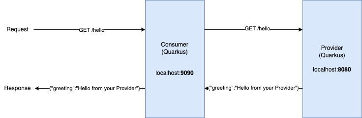

# Contract Testing with Pact & Quarkus
For the demo, I set up a consumer and provider service with quarkus.  
The consumer provides a rest api interface and, when called, it sends another request to the provider service.  
The provider provides a rest api interface and, when called, it sends a response "Hello from your Provider!".  

  

# Run project
Clone this repository or follow the [WORKSHOP](WORKSHOP.md) to create the project from scratch.  


## Run provider
```console
provider ❯ ./mvnw quarkus:dev
```
Visit http://localhost:8080

## Run consumer
```console
consumer ❯ ./mvnw quarkus:dev
```
Visit http://localhost:9090

## Create (consumer driven) contract 
(If a provider is running, kill it to make sure that port 8080 is available)  
```console
consumer ❯ mvn ./mvnw test
```
Pact contract is stored at: `consumer/target/pacts`  

## Test provider against contract
(If a provider is running, kill it to make sure that port 8080 is available)  
```console
provider ❯ mvn ./mvnw test
```